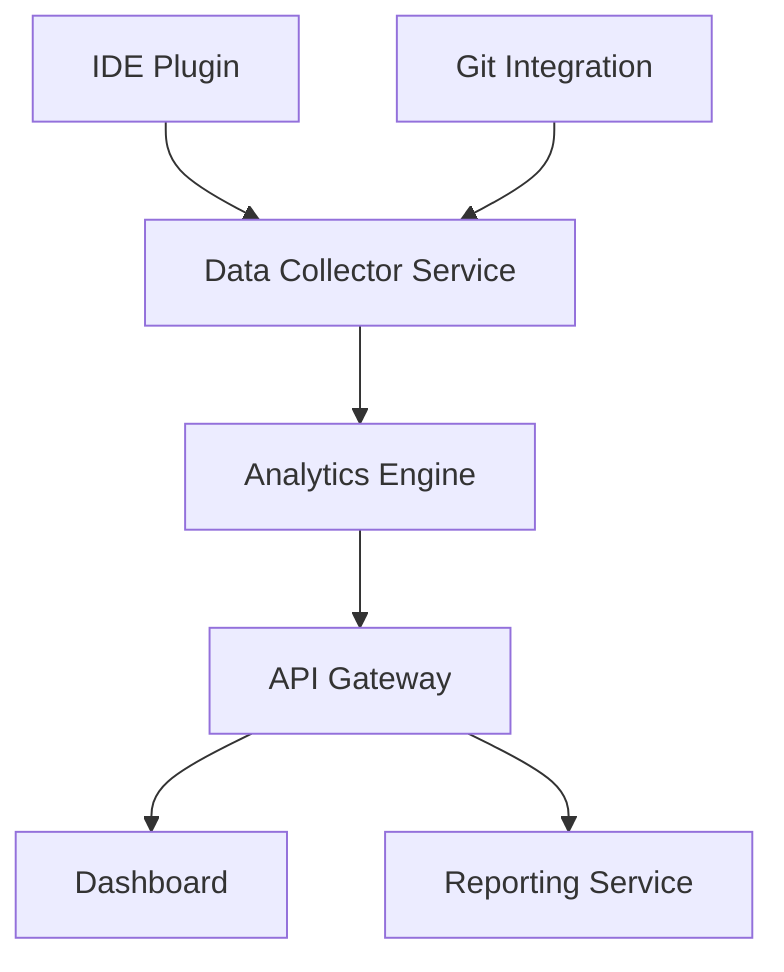

# CodeVitals

## Core Features

- **IDE Integration**
    - Plugin support for popular IDEs (IntelliJ, VS Code, Eclipse)
    - Track time spent in different files and projects
    - Monitor coding patterns and language usage
    - Analyze debugging time and frequency
- **Git Analytics**
    - Commit frequency and patterns
    - Code review time analysis
    - Branch lifetime tracking
    - Pull request metrics
    - Team collaboration patterns
- **Performance Metrics**
    - Code complexity trends
    - Bug fix frequency
    - Feature delivery time
    - Test coverage evolution

## Technical Architecture

## Implementation Stack

- **Backend**
    - Kotlin + Spring Boot for microservices
    - Spring WebFlux for reactive programming
    - PostgreSQL for structured data
    - MongoDB for activity logs
    - Redis for caching
- **Frontend**
    - React with TypeScript
    - D3.js for data visualization
    - Material-UI for components

## Monetization Opportunities

- Freemium model for individual developers
- Team subscriptions with advanced analytics
- Enterprise packages with custom integrations
- Consulting services based on collected data

## Development Phases

- [ ]  Phase 1: Core IDE plugin and basic Git integration
- [ ]  Phase 2: Analytics engine and basic dashboard
- [ ]  Phase 3: Advanced metrics and team collaboration features
- [ ]  Phase 4: Machine learning predictions and recommendations
- [ ]  Phase 5: Enterprise features and custom integrations

## Learning Opportunities

This project provides excellent opportunities to learn:

- Kotlin coroutines for async operations
- Spring Boot microservices architecture
- Event-driven design patterns
- Real-time data processing
- Plugin development for different IDEs
- Data visualization techniques

## Potential Challenges

- Ensuring data privacy and security
- Handling large volumes of activity data
- Creating meaningful metrics from raw data
- Building reliable IDE integrations
- Maintaining real-time performance